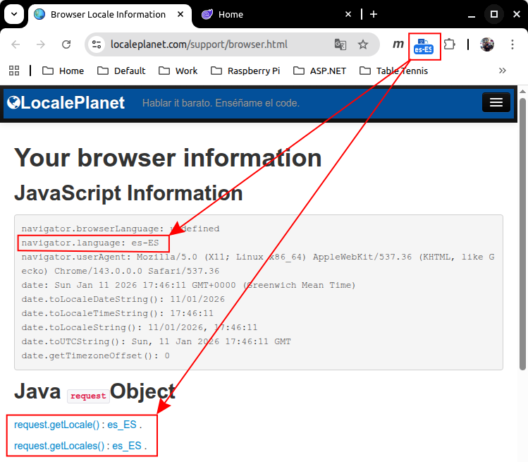
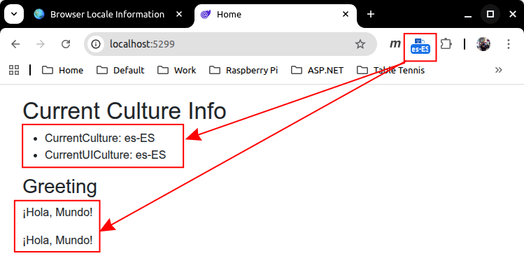

# How to localise a Blazor web app


<br/>



## Background
Based on the instructions at:

[ASP.NET Core Blazor globalization and localization](https://learn.microsoft.com/en-us/aspnet/core/blazor/globalization-localization?view=aspnetcore-10.0)

## Prerequisites
### Required
* Dotnet 10.0 or higher
* git

### Recommended
* [ResX Viewer and Editor](https://marketplace.visualstudio.com/items?itemName=TimHeuer.resx-editor)
* [Locale Switcher](https://chromewebstore.google.com/detail/locale-switcher/kngfjpghaokedippaapkfihdlmmlafcc?hl=en-GB&utm_source=ext_sidebar) for Google Chrome

## Getting started

```bash
# clone repository
git clone https://github.com/TrevorDArcyEvans/Blazerloc.git

# build code
cd BlazerLoc
dotnet restore
dotnet build

# run
dotnet run
```

* open [BlazerLoc](http://localhost:5299/)
* use 'Locale Switcher' to change locale to es-ES or de-DE

## How to test your browser locale
[Browser Locale Information](https://www.localeplanet.com/support/browser.html)


